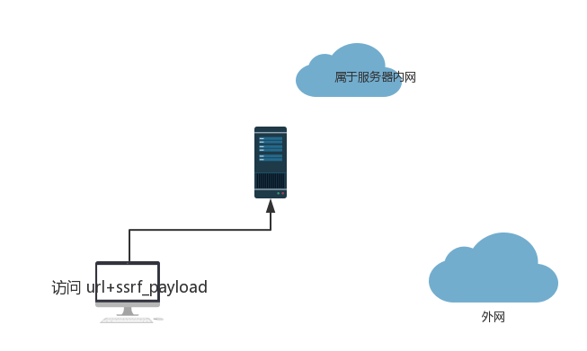

#   ssrf

        SSRF(Server-Side Request Forgery:服务请求伪造)是一种由攻击者构造，从而让服务端发起请求的一种安全漏洞，它将一个可以发起网络请求的服务当作跳板来攻击其他服务，SSRF的攻击目标一般是内网。  
        当服务端提供了从其他服务器获取数据的功能(如:从指定URL地址获取网页文本内容、加载指定地址的图片、下载等)，但是没有对目标地址做过滤与限制时就会出现SSRF。 

 
  

###   当ssrf_payload是一个正常地址时候，则不会出现问题，但当ssrf_payload是服务器的内网地址时，服务器就会返回自己内网中的内容。

-   ## ssrf危害
    -   可以对外网、服务器所在内网、本地进行端口扫描，获取一些服务的banner信息;
    -   攻击运行在内网或本地的应用程序（比如溢出）;
    -   对内网web应用进行指纹识别，通过访问默认文件实现;
    -   攻击内外网的web应用，主要是使用get参数就可以实现的攻击（比如struts2，sqli等）;
    -   利用file协议读取本地文件等。

 
    
